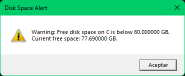

# Disk Space Warning

**Disk Space Warning** is a small silent and standalone application for Windows designed to be run periodically with **task scheduler** that checks the available disk space on a specified drive. If the available space falls below a user-defined threshold, the app displays a warning message. The threshold can be configured via a simple `config.ini` file.



---

## Features

- The app alerts free disk space on a specified drive (default: `C:`).
- Displays an alert if the available space falls below the configured threshold.
- Runs silently in the background without opening window (except for the message window when needed).
- Automatically creates a configuration file (`config.ini`) if it does not exist.
- Logs disk space information and alerts to a log file (`log.txt`).

---

## Configuration

The application reads its settings from a configuration file named `config.ini`. The file should be placed in the same directory as the application executable. If the file does not exist, the application will create a default configuration file.

### Example `config.ini`

```ini
threshold=50
drive=C,D
```

Configuration Parameters

- threshold: The minimum free disk space (in GB) required before a warning is displayed.
- drive: A comma-separated list of drives to monitor (e.g., C,D).

## Usage

Ensure the config.ini file is properly configured with the desired threshold and drives to monitor.

Run the application executable.

The application will read the configuration file and monitor the specified drives.

If the free disk space on any monitored drive falls below the threshold, a warning message will be displayed, and the event will be logged to log.txt.

To use with Windows Task Scheduler don't forget to set the option "Start in (optional)" to the same path where the executable is (without quotation marks " ):


## Logs

The application logs the following information to log.txt:

Parsed configuration values (threshold and drives).

Free disk space for each monitored drive.

Alerts when free disk space is below the threshold.

## Example Output

When the application runs, if the free disk space is below the threshold a warning window will pop up,
in any other case it will log the information to log.txt like this:

```txt file
Threshold: 150 GB
Drives: C, D
Drive: C, Free space: 100.00 GB
Drive: D, Free space: 200.00 GB
Alert: Warning: Free disk space on C is below 150 GB.
       Current free space: 100.00 GB.
```